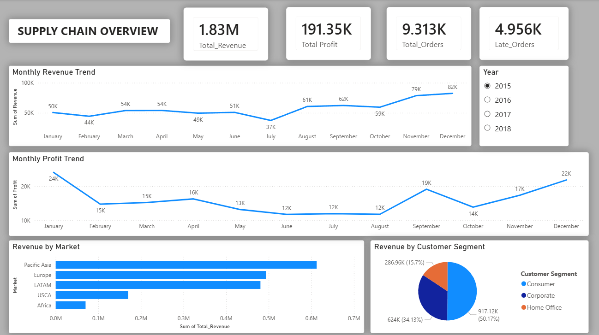
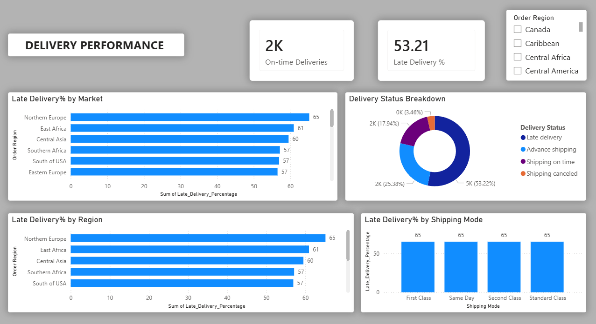
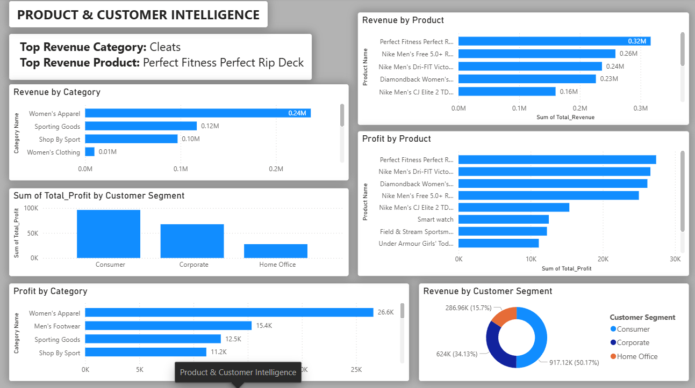

# Supply Chain Performance & Inventory Risk Intelligence Dashboard

A Power BI and SQL project focused on supply chain analytics, delivery performance, inventory risk, and business intelligence reporting.

## Project Overview

This project aims to analyze supply chain operations and identify key business risks related to delivery performance, inventory management, customer demand, and operational efficiency.

Using SQL and Power BI, the project transforms raw supply chain data into actionable business insights through KPI reporting, interactive dashboards, and analytical reporting.

---

## Business Problems

- Delivery delays affecting customer satisfaction
- Poor visibility into regional performance
- Inventory risk and stock shortages
- Product profitability analysis
- Customer segment performance tracking

---

## Tools & Technologies

- MySQL
- SQL
- Power BI
- DAX
- Power Query
- Git & GitHub

---

## Project Status

🚧 Currently in Development

### Planned Phases

- [x] Project Setup
- [x] Data Understanding
- [x] Data Audit & Profiling
- [x] Exploratory Analysis
- [x] KPI Development
- [x] Reporting Views
- [x] Power BI Data Modeling
- [x] Dashboard Development

---

## Dashboard Preview

### Executive Overview

### Delivery Performance

### Product & Customer Intelligence

## Author

Hanok Kumar